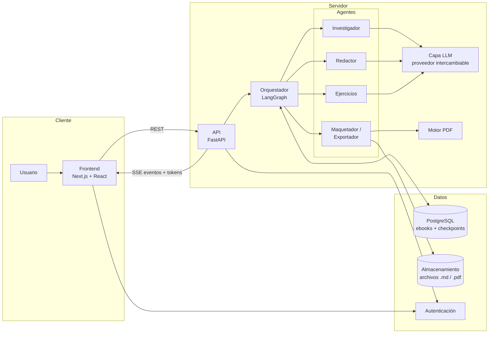
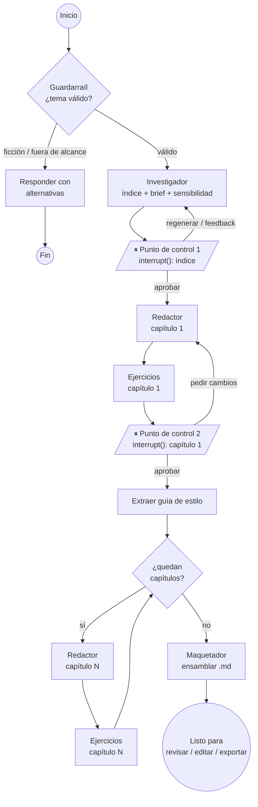
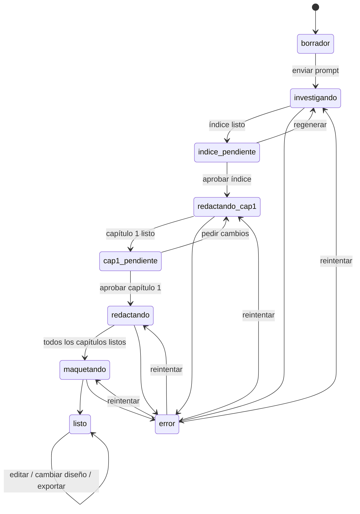
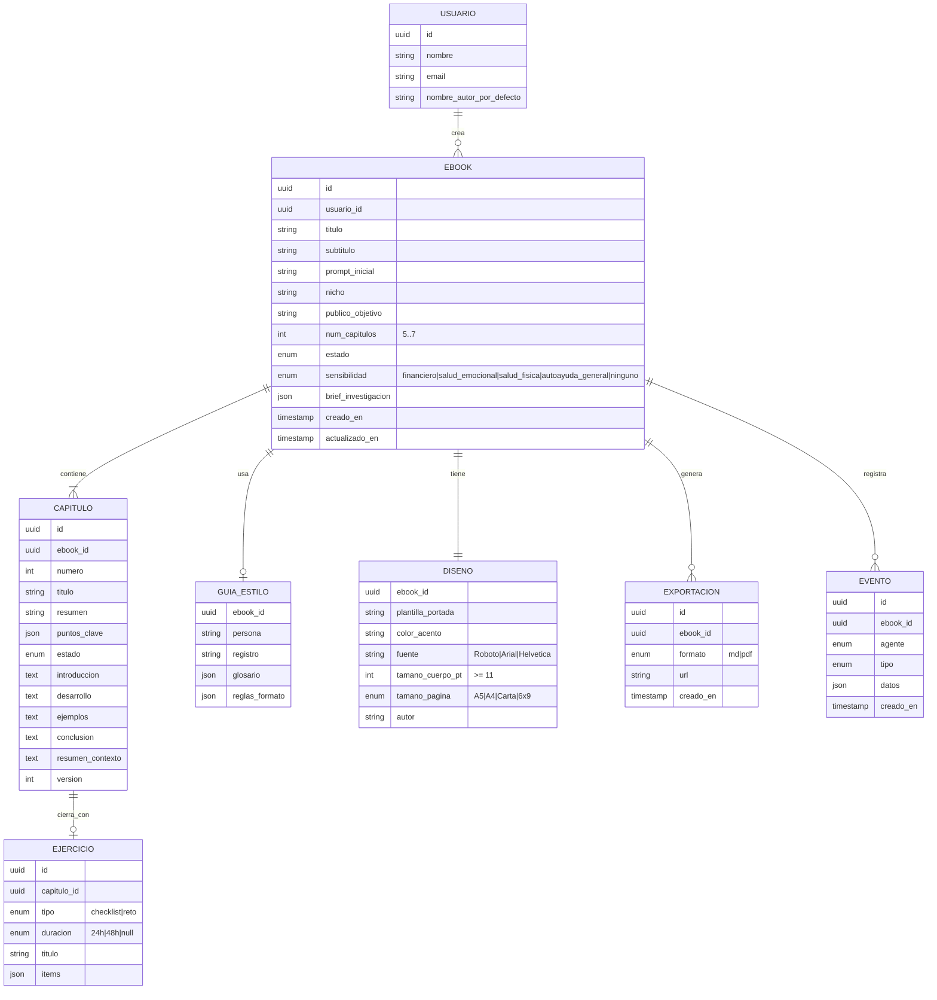

# 03 · Arquitectura del sistema

> Arquitectura **propuesta** a partir de las decisiones del equipo: Next.js en el frontend, Python en el backend y un LLM por definir.
> Lo marcado como **(propuesta)** puede cambiar; cualquier cambio se registra en [06-decisiones](./06-decisiones.md).

## 1. Vista general



| Capa | Tecnología | Responsabilidad |
|---|---|---|
| Frontend | Next.js (App Router), React, TypeScript, Tailwind CSS, shadcn/ui, Motion | Toda la interfaz. Consume la API REST y el stream SSE. En las fases 2 y 3 funciona **con mocks**. |
| API | FastAPI (Python) | Autenticación de las peticiones, CRUD de ebooks, puntos de control, exportaciones, stream de eventos. |
| Orquestador | LangGraph | Grafo de agentes, estado compartido, interrupciones HITL (`interrupt()`) y persistencia (checkpointer en Postgres). |
| Agentes | Módulos Python + prompts en archivos | Un módulo por rol (RNF-04). |
| Capa LLM | Abstracción (LangChain chat models o LiteLLM) **(propuesta)** | Poder cambiar de proveedor sin tocar a los agentes. El proveedor está por definir. |
| Motor PDF | WeasyPrint o Chromium headless **(pendiente)** | HTML + CSS → PDF etiquetado (RA-01, RA-03). |
| Datos | PostgreSQL + almacenamiento de objetos + autenticación. Supabase lo cubre todo **(propuesta)** | Persistencia, archivos exportados y cuentas. |

## 2. Agentes

| Agente | Entrada | Salida | Requerimientos |
|---|---|---|---|
| **Investigador** | Prompt o nicho, público objetivo, número de capítulos deseado | Validación del tema (ficción o no), categoría de sensibilidad, **índice** (5-7 capítulos con título, resumen y puntos clave) y *brief* de investigación (conceptos, términos, enfoques) | RF-01, RF-02, RÉR-01, RÉR-02 |
| **Redactor** | Índice aprobado, capítulo N, *brief*, guía de estilo, resúmenes previos, feedback del usuario | Introducción, Desarrollo, Ejemplos cotidianos y Conclusión del capítulo N, más un resumen corto para contexto | RF-03, RNF-01, RNF-03, RA-02, RÉR-01, RÉR-03 |
| **Ejercicios** | Capítulo N redactado, preferencia de tipo | Ejercicio `checklist` o `reto` (24/48 h) | RF-04, RÉR-03 |
| **Maquetador / Exportador** | Ebook completo, configuración de diseño, categoría de sensibilidad | `.md` ensamblado (portada → aviso → índice → capítulos), PDF etiquetado | RF-06, RA-01, RA-03, RÉR-02 |

Además hay dos pasos auxiliares que no son "agentes" del requerimiento, sino funciones del orquestador:
- **Guardarraíl de entrada:** clasificación rápida del tema antes de iniciar (RF-01).
- **Extractor de guía de estilo:** se ejecuta al aprobar el capítulo 1 (RNF-03).

## 3. Grafo de orquestación



- Las interrupciones se guardan en el checkpointer: si el usuario cierra la pestaña, el grafo **sigue pausado** en el mismo nodo (RD-07).
- La edición manual y la exportación a PDF ocurren **fuera del grafo**, sobre el ebook ya ensamblado. Así editar no obliga a volver a correr agentes.

## 4. Estados del ebook



| Estado | Insignia en la biblioteca | ¿Requiere acción del usuario? |
|---|---|---|
| `borrador` | Borrador | Sí: enviar |
| `investigando`, `redactando_cap1`, `redactando`, `maquetando` | En progreso | No |
| `indice_pendiente`, `cap1_pendiente` | **Esperando tu aprobación** | **Sí** |
| `listo` | Listo | No (opcional: editar o exportar) |
| `error` | Con error | Sí: reintentar |

Estados de cada capítulo: `pendiente → generando → generado → aprobado`, más `editado` (tras una edición manual) y `error`.

## 5. Modelo de datos (propuesta)



## 6. Contrato de la API (propuesta)

Todas las rutas requieren autenticación y el prefijo es `/api`.

| Método | Ruta | Uso |
|---|---|---|
| `GET` | `/niches` | Catálogo de nichos sugeridos |
| `POST` | `/ebooks` | Crear un ebook (prompt y parámetros) e iniciar el pipeline |
| `GET` | `/ebooks` | Biblioteca, con filtros `estado`, `q` y paginación |
| `GET` | `/ebooks/{id}` | Detalle completo: índice, capítulos, diseño, estado |
| `PATCH` | `/ebooks/{id}` | Renombrar o editar metadatos |
| `DELETE` | `/ebooks/{id}` | Eliminar |
| `GET` | `/ebooks/{id}/events` | **Stream SSE** con eventos del pipeline y tokens |
| `POST` | `/ebooks/{id}/outline/approve` | Punto de control 1: aprobar (con ediciones del usuario) |
| `POST` | `/ebooks/{id}/outline/regenerate` | Punto de control 1: regenerar (`feedback`, `capitulo?`) |
| `POST` | `/ebooks/{id}/chapters/1/approve` | Punto de control 2: aprobar el capítulo ancla |
| `POST` | `/ebooks/{id}/chapters/1/regenerate` | Punto de control 2: pedir cambios (`feedback`) |
| `PATCH` | `/ebooks/{id}/chapters/{n}` | Edición manual de un capítulo |
| `PUT` | `/ebooks/{id}/design` | Portada y estilo del PDF (validado contra RA-03) |
| `POST` | `/ebooks/{id}/exports` | Generar una exportación (`formato: md \| pdf`) |
| `POST` | `/ebooks/{id}/retry` | Reintentar después de un error |

### Eventos SSE

```ts
type PipelineEvent =
  | { type: "run.started"; ebookId: string }
  | { type: "agent.started"; agent: AgentId; chapter?: number }
  | { type: "agent.progress"; agent: AgentId; message: string; chapter?: number }
  | { type: "section.started"; chapter: number; section: SectionId }
  | { type: "token"; chapter: number; section: SectionId; delta: string }
  | { type: "agent.completed"; agent: AgentId; chapter?: number }
  | { type: "checkpoint.required"; checkpoint: "outline" | "chapter1" }
  | { type: "chapter.completed"; chapter: number; durationMs: number }
  | { type: "ebook.ready" }
  | { type: "run.failed"; error: string; retryable: boolean };

type AgentId = "investigador" | "redactor" | "ejercicios" | "maquetador";
type SectionId = "introduccion" | "desarrollo" | "ejemplos" | "conclusion" | "ejercicio";
```

## 7. Tipos base del dominio (TypeScript, para el frontend)

Este es el contrato que deben cumplir **los mocks del frontend** y, más adelante, **la API real**.

```ts
type EbookStatus =
  | "borrador" | "investigando" | "indice_pendiente" | "redactando_cap1"
  | "cap1_pendiente" | "redactando" | "maquetando" | "listo" | "error";

type Sensitivity = "financiero" | "salud_emocional" | "salud_fisica" | "autoayuda_general" | "ninguno";

interface Ebook {
  id: string;
  title: string;
  subtitle?: string;
  prompt: string;
  niche?: string;
  audience?: string;
  status: EbookStatus;
  sensitivity: Sensitivity;
  chapters: Chapter[];          // siempre 5..7 una vez propuesto el índice
  design: EbookDesign;
  createdAt: string;
  updatedAt: string;
}

interface Chapter {
  number: number;
  title: string;
  summary: string;
  keyPoints: string[];
  status: "pendiente" | "generando" | "generado" | "aprobado" | "editado" | "error";
  sections?: {
    introduccion: string;       // Markdown
    desarrollo: string;
    ejemplos: string;
    conclusion: string;
  };
  exercise?: Exercise;
}

type Exercise =
  | { type: "checklist"; title: string; items: string[] }
  | { type: "reto"; title: string; duration: "24h" | "48h"; steps: string[] };

interface EbookDesign {
  coverTemplate: string;
  accentColor: string;          // validado: contraste >= 4.5:1 sobre blanco
  font: "Roboto" | "Arial" | "Helvetica";
  bodySizePt: number;           // >= 11
  pageSize: "A5" | "A4" | "Carta" | "6x9";
  author?: string;
}
```

## 8. Estrategias transversales

### Coherencia (RNF-03)
1. Al aprobar el capítulo 1 → el extractor genera la **guía de estilo** (persona, registro, glosario, formato).
2. Cada capítulo N recibe: guía de estilo, índice completo, *brief* y **resúmenes de los capítulos 1 a N-1**.
3. Generación **secuencial** de los capítulos 2 a N.

### Rendimiento (RNF-02)
- Streaming de tokens por SSE desde el primer momento.
- Salida acotada por capítulo (unas 800 a 1.200 palabras).
- Tiempo límite de 60 s por capítulo, con un reintento automático y luego estado `error` reintentable.
- El frontend deja leer los capítulos terminados mientras se generan los demás.

### Temas sensibles (RÉR-02) y ficción (RF-01)
- El guardarraíl de entrada detecta la ficción **antes** de gastar en el pipeline completo.
- El Investigador asigna la categoría de sensibilidad, y el Maquetador inserta el aviso que corresponde a esa categoría.
- La API impide quitar el aviso cuando `sensitivity !== "ninguno"`.

### Exportación (RF-06, RA-01, RA-03)
- **Markdown:** ensamblado por el Maquetador con jerarquía estricta (H1 capítulo, H2 sección, H3 subtema).
- **PDF:** MD → HTML (plantilla con los estilos de RA-03) → PDF **etiquetado**.
  - Opción A: **WeasyPrint** (Python nativo, soporta variantes PDF/UA).
  - Opción B: **Chromium headless** (Playwright) con `tagged: true`; la paginación la da CSS Paged Media.
  - Decisión pendiente: hay que hacer una prueba de concepto de accesibilidad con NVDA en ambas.

### Frontend primero, con mocks
Las fases 2 y 3 construyen el frontend **sin backend real**:
- Una capa de datos (`lib/api/`) con una interfaz única y dos implementaciones: `mock` (activa) y `http` (más adelante).
- El mock **simula el pipeline completo**: eventos SSE con retardos realistas, streaming de texto palabra por palabra, las dos pausas HITL y errores simulables.
- Hay datos de ejemplo realistas y en español (un ebook de finanzas para universitarios, otro de gestión del tiempo...) que cumplen RÉR-03.
- Cambiar de mock a API real solo requiere cambiar una variable de entorno (`NEXT_PUBLIC_API_MODE=mock|http`).

## 9. Estructura del repositorio (objetivo)

```
multiagente-ebooks/
├── CLAUDE.md                  # guía para Claude Code
├── README.md
├── docs/                      # documentación del proyecto
├── .claude/skills/            # skills de diseño/frontend del proyecto
├── skills-lock.json           # versiones de las skills (restaurables)
├── frontend/                  # Next.js (fases 2-3)
│   ├── app/                   # rutas (App Router)
│   ├── components/            # UI (shadcn/ui personalizado + componentes propios)
│   ├── lib/api/               # capa de datos: mock | http
│   ├── lib/mocks/             # datos y simulador de pipeline
│   └── styles/                # tokens del sistema de diseño
└── backend/                   # FastAPI + LangGraph (fase 4)
    ├── app/api/               # endpoints
    ├── app/graph/             # orquestador (nodos, estado, interrupciones)
    ├── app/agents/            # investigador/, redactor/, ejercicios/, maquetador/
    ├── app/prompts/           # prompts versionados por agente (RNF-04)
    ├── app/llm/               # capa de abstracción del proveedor
    └── app/export/            # MD → HTML → PDF + plantillas
```
