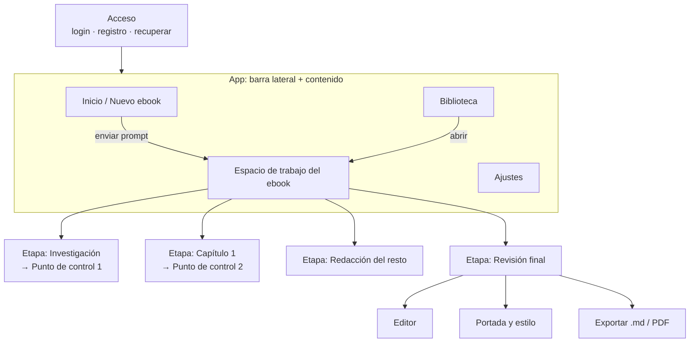
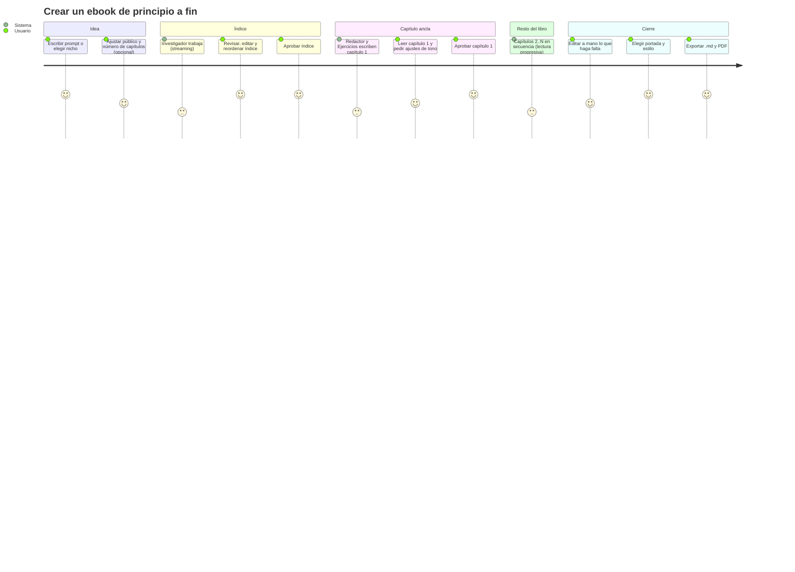

# 04 · Experiencia de usuario (UX)

> Aquí se define **qué pantallas existen, qué hace el usuario en cada una y cómo se comporta el sistema**. La **dirección visual** (colores, tipografía, estilo) se decide en la fase de diseño; su punto de partida es [05-brief-diseno](./05-brief-diseno.md).
>
> **Actualización (2026-09-28):** el diseño resultante está en [07-diseno-interfaz](./07-diseno-interfaz.md), que manda si hay diferencias. Los cambios principales son dos: la revisión final se hace dentro de `/ebook/[id]` (no en `/ebook/[id]/editar`) y el espacio de trabajo usa la distribución **Libro abierto**.

## 1. Principios de experiencia

1. **Conversar para empezar, trabajar para terminar.** Se entra con un prompt, igual que en Gemini, y a partir de ahí el ebook tiene un **espacio de trabajo** propio donde se ve, se aprueba y se edita. Es el modelo híbrido elegido.
2. **El usuario tiene la última palabra.** Los puntos de control no son un trámite: son el momento en que el usuario da forma al libro. Tienen que ser claros, cómodos y reversibles.
3. **Mostrar el trabajo, no esconderlo.** Se ve qué agente trabaja y qué escribe (streaming). Nada de pantallas en blanco con un spinner.
4. **El libro es el protagonista.** El contenido se presenta como un libro (páginas, tipografía editorial) y no como una respuesta de chat.
5. **Imposible romper las reglas.** La interfaz impide los estados inválidos (menos de 5 o más de 7 capítulos, quitar secciones obligatorias, quitar el aviso, usar tipografía menor de 11 pt) en lugar de mostrar errores después.
6. **Se puede retomar en cualquier momento.** Todo se guarda. Salir y volver nunca hace perder trabajo.

## 2. Arquitectura de información

### Rutas propuestas

| Ruta | Pantalla |
|---|---|
| `/login`, `/registro`, `/recuperar` | Acceso |
| `/` | Inicio / Nuevo ebook |
| `/biblioteca` | Biblioteca |
| `/ebook/[id]` | Espacio de trabajo (muestra la etapa actual del ebook) |
| ~~`/ebook/[id]/editar`~~ | ~~Revisión final~~. Ahora forma parte de `/ebook/[id]` (ver 07 §4.1). |
| `/ajustes` | Perfil y preferencias |

## 3. Flujo principal (camino feliz)

## 4. Inventario de pantallas

### 4.1 Acceso (login / registro / recuperar)

- **Objetivo:** entrar rápido y sin fricción.
- **Contenido:** correo y contraseña, y proveedor OAuth *(propuesta: Google)*. Enlace para recuperar la contraseña.
- **Estados:** credenciales inválidas (mensaje en línea, sin borrar el correo), cargando, cuenta creada.
- **Nota:** tiene que transmitir la identidad del producto desde el primer segundo, sin caer en "una página de login genérica".

### 4.2 App shell: barra lateral

Inspirada en Gemini: colapsable y discreta.
- **Nuevo ebook** (acción principal, siempre visible).
- **Recientes:** ebooks agrupados por fecha (Hoy, Últimos 7 días, Anteriores). Cada uno muestra título e **insignia de estado** (en progreso, esperando tu aprobación, listo, con error).
- Enlace a la **Biblioteca** completa.
- Parte inferior: avatar, **Ajustes**, cambio de tema claro/oscuro y cerrar sesión.
- **Móvil:** se convierte en un cajón (*drawer*) que se abre desde un botón de menú.

### 4.3 Inicio / Nuevo ebook

La pantalla que más se inspira en Gemini.
- **Saludo personalizado** ("Hola, Fran") y pregunta guía ("¿Sobre qué quieres escribir hoy?").
- **Caja de prompt** central, amplia y protagonista, con placeholder de ejemplo. Enviar con Enter; Shift+Enter hace salto de línea.
- **Chips o tarjetas de nichos** sugeridos (RF-01). Al hacer clic se rellena el prompt con una idea editable, sin enviarla directamente.
- **Ajustes opcionales** (desplegables o en un popover junto a la caja): público objetivo, número de capítulos (5 / 6 / 7 / automático) y tipo de ejercicio preferido.
- **Estado de rechazo por ficción:** respuesta amable debajo de la caja, con dos o tres reformulaciones como chips.
- **Primera vez (estado vacío):** una explicación muy breve del proceso en tres pasos (idea → apruebas → exportas), sin tutoriales largos.

### 4.4 Espacio de trabajo del ebook

Es el corazón de la aplicación. Tiene tres zonas; su disposición exacta se decide en diseño:

| Zona | Contenido |
|---|---|
| **Pipeline** | Los cuatro agentes (Investigador, Redactor, Ejercicios, Maquetador), cada uno con estado (en espera / trabajando / esperando por ti / completado / error) y la actividad actual ("Redactando capítulo 3 · Ejemplos cotidianos"). Incluye el avance global. |
| **Etapa actual** | Lo que hay que ver o decidir ahora: el índice, el capítulo 1, el avance de redacción o la revisión final. |
| **Vista previa** | El libro tal como va quedando, en formato página. |

> **Pregunta abierta para diseño:** en escritorio, la barra lateral global más estas tres zonas pueden ser demasiadas columnas. Opciones: colapsar la barra lateral a una franja de iconos dentro del espacio de trabajo, integrar el pipeline como una línea de tiempo horizontal, o mostrar la vista previa como un panel alternable.

#### Etapa A: Investigación → Punto de control 1 (índice)

1. **Mientras investiga:** el agente muestra su progreso con mensajes concretos ("Analizando el público: estudiantes universitarios", "Definiendo 6 capítulos") y el índice va apareciendo capítulo a capítulo.
2. **Pausa, punto de control 1.** El pipeline queda en "Esperando tu aprobación".
   - Lista de capítulos con **número, título y resumen**, editables en línea.
   - **Arrastrar para reordenar**, con una alternativa por teclado (botones subir/bajar o atajos).
   - **Agregar / eliminar** capítulo, limitado al rango 5-7 (botones deshabilitados con explicación) y con el contador "6 capítulos · entre 5 y 7".
   - **Regenerar un capítulo** (icono en cada fila) o **regenerar todo** con una caja de indicaciones.
   - Si el tema es sensible: aviso visible **"Este ebook incluirá un aviso legal"** con enlace para ver el texto.
   - Acción principal: **"Aprobar índice y escribir el capítulo 1"**.
3. **Regeneración:** la versión anterior se conserva y se puede volver a ella (*propuesta*: "Deshacer" o historial simple).

#### Etapa B: Capítulo 1 → Punto de control 2

1. **Mientras escribe:** el texto aparece en streaming dentro de la vista de lectura, con un indicador de sección (Introducción ✓ · Desarrollo … · Ejemplos ○ · Conclusión ○ · Ejercicio ○).
2. **Pausa, punto de control 2.**
   - Lectura cómoda del capítulo completo, con tipografía de libro.
   - Mensaje destacado: **"Este capítulo marcará el tono y el formato de todo el libro."**
   - **Pedir cambios**: chips rápidos ("Más cercano", "Más ejemplos", "Más corto", "Menos formal", "Otro tipo de ejercicio") y un campo libre.
   - **Editar a mano**: abre la edición del capítulo con sus bloques fijos. Si se edita, esa versión pasa a ser el ancla.
   - Acción principal: **"Aprobar y escribir el resto"**.

#### Etapa C: Redacción del resto

- Avance por capítulo (2 de 6, 3 de 6...), con el capítulo en curso en streaming.
- **Lectura progresiva:** los capítulos terminados ya se pueden abrir y leer.
- Tiempo estimado restante.
- El usuario puede salir: la redacción sigue en segundo plano y la insignia de la barra lateral muestra el avance.
- Al terminar, el Maquetador ensambla el libro y la pantalla pasa a la revisión final con una transición que se sienta como "el libro terminado".

#### Etapa D: Revisión final → editor, portada y estilo, exportación

- **Vista de lectura** de todo el libro, con navegación por capítulos.
- **Editor** (RD-03):
  - Edición por capítulo y por sección; los **nombres de sección son fijos** (no se pueden borrar) y el contenido es libre.
  - Formato permitido: negrita, cursiva, listas, citas, subtítulos H3. **No** se pueden crear H1 ni H2 manuales (RA-01).
  - Guardado automático con indicador ("Guardado hace unos segundos").
  - El aviso legal aparece como un bloque bloqueado, con un icono de candado y una explicación.
- **Portada y estilo** (RD-04, RA-03):
  - Título, subtítulo y autor (con el autor predeterminado del perfil como valor inicial).
  - Plantillas de portada tipográficas.
  - Color de acento con **validación de contraste en vivo**.
  - Fuente: Roboto, Arial o Helvetica. Tamaño de cuerpo: 11, 12 o 13 pt.
  - Tamaño de página: A5, A4, Carta o 6×9".
  - La vista previa se actualiza en vivo.
- **Exportar** (RF-06):
  - Diálogo con los formatos **.md** y **PDF**, nombre del archivo y resumen (capítulos, páginas estimadas, aviso incluido o no).
  - Estado de generación del PDF, seguido de la descarga.
  - Nota de transparencia: "Contenido original generado con asistencia de IA".

### 4.5 Biblioteca

- Vista de **cuadrícula** (miniaturas de portada) o de **lista**.
- **Búsqueda** por título y **filtros** por estado y por nicho.
- Cada ebook muestra portada o miniatura, título, fecha, número de capítulos y estado.
- Acciones: abrir o continuar, renombrar, descargar (si está listo), duplicar *(opcional)* y eliminar (con confirmación).
- **Estado vacío:** invita a crear el primer ebook con un acceso directo al inicio.

### 4.6 Ajustes

- Perfil: nombre, correo, avatar y **nombre de autor predeterminado** (para las portadas).
- Preferencias: tema (claro / oscuro / sistema), tipo de ejercicio preferido por defecto y reducción de movimiento.
- Cuenta: cambiar contraseña, cerrar sesión y eliminar cuenta.

## 5. Estados del sistema (en todas las pantallas)

| Situación | Comportamiento esperado |
|---|---|
| **Cargando datos** | *Skeletons* con la forma del contenido real; nunca una pantalla en blanco. |
| **Agente trabajando** | Actividad concreta en texto y streaming visible; se evitan los spinners genéricos. |
| **Esperando al usuario** | Pausa evidente: el agente queda en estado "esperando por ti", la acción principal destaca y hay insignia en la barra lateral. |
| **Error reintentable** | Mensaje humano ("No pudimos terminar el capítulo 3"), botón **Reintentar** y conservación de todo lo ya generado. |
| **Error no reintentable** | Explicación clara y camino alternativo (volver a la biblioteca o contactar). |
| **Sin conexión** | Aviso no intrusivo; el stream se reconecta automáticamente y se reanuda. |
| **Vacío** | Mensajes que invitan a actuar (biblioteca vacía, primera visita). |
| **Éxito** | Confirmación breve y celebratoria sin exagerar (por ejemplo, al terminar el libro o al exportar). |

## 6. Comportamiento responsive (RD-08)

| Ancho | Comportamiento |
|---|---|
| **Escritorio (≥ 1280 px)** | Experiencia completa: barra lateral y espacio de trabajo con sus zonas visibles. |
| **Laptop (1024-1279 px)** | Barra lateral colapsada a iconos; la vista previa se alterna con la etapa actual. |
| **Tablet (768-1023 px)** | Barra lateral como cajón; espacio de trabajo en dos zonas o en pestañas. |
| **Móvil (< 768 px)** | Pestañas: **Etapa · Vista previa · Pipeline**. El prompt de inicio sigue siendo protagonista. La edición es posible pero no es prioritaria. |

## 7. Accesibilidad de la aplicación (RD-06)

- **WCAG 2.2 AA** como mínimo: contraste de 4,5:1 en texto y 3:1 en componentes y foco.
- Todo se puede hacer **por teclado**, incluido reordenar el índice. El foco es visible y tiene un estilo propio (no el que trae el navegador por defecto).
- El streaming de texto se anuncia a los lectores de pantalla de forma **resumida** mediante regiones `aria-live` "polite" con mensajes de estado ("Capítulo 3 terminado"), sin leer cada token.
- Se respeta `prefers-reduced-motion`: las animaciones pasan a transiciones simples o desaparecen.
- Hay objetivos táctiles de 24×24 px como mínimo (WCAG 2.2) y de 44×44 px como recomendación en móvil.
- Idioma declarado `lang="es"`.

## 8. Voz y microcopy

- **Tuteo**, cercano y directo: es el mismo tono que se pide para los ebooks (RNF-01).
- Hablar de lo que hace el usuario y no de la tecnología: "Aprobar índice" en lugar de "Confirmar output"; "Estamos escribiendo el capítulo 3" en lugar de "Procesando...".
- **Nada de muletillas "de IA"**: sin "¡Desbloquea tu potencial!", "Potenciado por IA ✨", "Magia" ni "Revolucionario".
- Los agentes tienen nombres de rol en español (Investigador, Redactor, Ejercicios, Maquetador) y verbos de actividad concretos.
- Los errores explican qué pasó y qué hacer, sin culpar al usuario.

| Situación | ❌ Evitar | ✅ Preferir |
|---|---|---|
| Botón principal del índice | "Continuar" | "Aprobar índice y escribir el capítulo 1" |
| Agente trabajando | "Procesando..." | "Redactando el capítulo 3 · Ejemplos cotidianos" |
| Pausa | "Acción requerida" | "Tu turno: revisa el índice" |
| Ficción detectada | "Error: contenido no permitido" | "Aquí creamos guías prácticas sobre situaciones reales. ¿Probamos con alguna de estas ideas?" |
| Error | "Error 500" | "No pudimos terminar el capítulo 3. Lo que ya estaba escrito sigue a salvo." |
| Libro listo | "Tarea completada" | "Tu ebook está listo. Revísalo, dale tu estilo y descárgalo." |
