# 09 · Verificación de requerimientos

> Cómo cumple Folio cada requerimiento de [`requerimientos.txt`](./requerimientos.txt): **qué pide, cómo se cumple, en qué parte del código está, cómo verlo tú mismo y qué prueba automática lo demuestra.**
> Fecha: 2026-09-29 · Sitio: https://franjmd0508.github.io/multiagente-inteligente-ebooks/ · Pruebas: [`frontend/e2e/requisitos.spec.ts`](../frontend/e2e/requisitos.spec.ts) (**18 de 18 superadas**).

## Resumen

| Estado | Significado | Requerimientos |
|---|---|---|
| ✅ **Cumple** | Funciona hoy en el sistema y lo comprueba una prueba automática. | RF-01, RF-02, RF-03, RF-04, RF-05, RF-06, RA-01, RA-03, RÉR-02 |
| 🟡 **Cumple en la interfaz** | La interfaz ya lo soporta y la prueba pasa con el contenido simulado, pero el resultado final depende de la IA real del backend (fase 4). | RNF-01, RNF-02, RNF-03, RA-02, RÉR-01, RÉR-03 |
| ⏳ **Pendiente (fase 4)** | Está diseñado y reflejado en la interfaz, pero la pieza principal es el backend, que todavía no existe. | RNF-04 |

> **Por qué hay 🟡:** en esta fase los cuatro agentes se simulan en el navegador con textos de plantilla. Los requisitos sobre *cómo escribe la IA* (tono, tiempos, coherencia, claridad, originalidad, sesgos) quedarán cumplidos del todo cuando el Redactor sea un modelo de lenguaje con los prompts y controles descritos en [03-arquitectura](./03-arquitectura.md).

**Cómo usar el sitio para verificar:** entra con **“Continuar con Google”** (acceso simulado). Si quieres ir rápido, activa **Ajustes → Demostración → Velocidad: Rápida**. La biblioteca de ejemplo trae libros en distintas etapas.

**Cómo repetir las pruebas:**

```bash
cd frontend
npm run test:e2e          # 18 pruebas, ~1,5 minutos; capturas en e2e/evidencias/
E2E_BASE_URL=https://franjmd0508.github.io/multiagente-inteligente-ebooks npm run test:e2e   # contra el sitio publicado
```

---

## Requerimientos funcionales

### RF-01 · Selección de nicho y temática cotidiana — ✅ Cumple

**Qué pide:** elegir o parametrizar nichos de crecimiento personal basados en situaciones reales, **descartando la ficción**.

**Cómo lo cumple**
- El inicio ofrece nichos de situaciones reales como chips (Finanzas para universitarios, Gestión del tiempo, Resolver conflictos, Primer empleo, Hábitos y rutinas). También admite una idea libre, y el sistema detecta a qué nicho pertenece.
- Si la idea es de ficción (novela, cuento, dragones, poema…), **no se crea el ebook**. Aparece “Folio crea guías prácticas sobre situaciones reales” con tres alternativas de no ficción.

**Dónde está**
- Catálogo de nichos: `frontend/src/lib/niches.ts:16` (`NICHES`) y detección `:115` (`detectNiche`)
- Guardarraíl de ficción: `frontend/src/lib/guardrails.ts:23` (`isFiction`)
- Bloqueo al enviar: `frontend/src/app/(app)/page.tsx:36`

**Cómo verlo**
1. En el inicio, toca un chip: la caja se llena con una idea editable.
2. Escribe “Escribe una novela de dragones” y envía: aparece el mensaje con alternativas y no se crea nada.

**Prueba:** `RF-01` comprueba que hay 5 o más nichos, que un chip rellena la idea y que la ficción no crea ningún ebook.

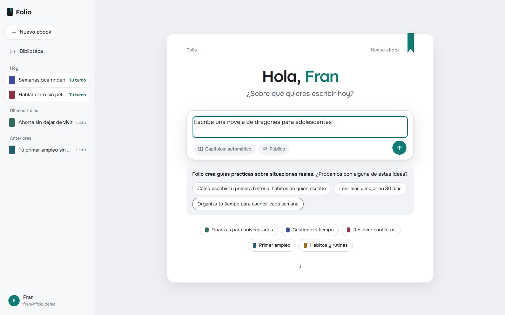

---

### RF-02 · Temario de 5 a 7 capítulos — ✅ Cumple

**Qué pide:** el Agente Investigador propone un temario con un **límite estricto** de 5 a 7 capítulos.

**Cómo lo cumple**
- Al crear el ebook solo se puede elegir 5, 6, 7 o automático (6).
- En el índice, con 5 capítulos los botones de **quitar se desactivan**; con 7, el botón de agregar dice “7 capítulos · máximo alcanzado” y queda desactivado. Un mensaje explica el límite.
- La capa de datos vuelve a validar el rango aunque se intente saltar la interfaz.

**Dónde está**
- Límites: `frontend/src/lib/types.ts:146` (`MIN_CHAPTERS` / `MAX_CHAPTERS`)
- Validación: `frontend/src/lib/api/index.ts:75` (`addOutlineItem`) y `:96` (`removeOutlineItem`)
- Interfaz: `frontend/src/components/workspace/stages/OutlineReview.tsx:186`
- Número de capítulos generados: `frontend/src/lib/api/mock/content.ts:308`

**Cómo verlo**
1. En el inicio, toca la píldora “Capítulos: automático”, elige **5** y crea el ebook.
2. En el índice, los íconos de papelera aparecen desactivados.
3. Toca “Agregar capítulo” dos veces: llegas a 7 y el botón se desactiva.

**Prueba:** `RF-02` comprueba 5 capítulos con quitar desactivado, 7 con agregar desactivado y 6 en automático.

| Mínimo (5) | Máximo (7) |
|---|---|
| 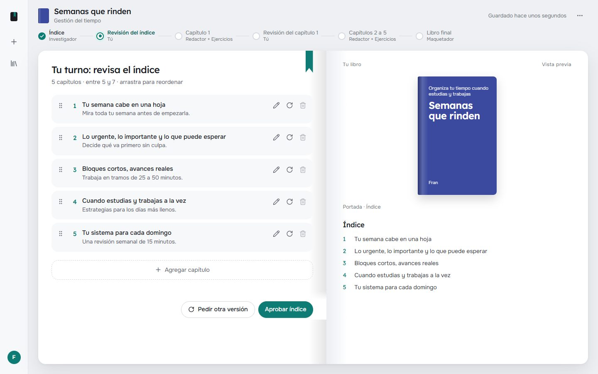 | 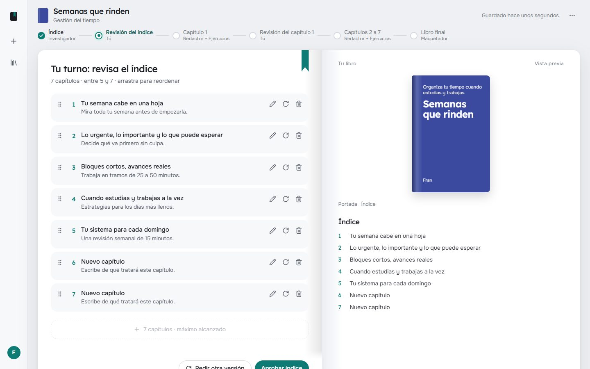 |

---

### RF-03 · Estructura estandarizada del capítulo — ✅ Cumple

**Qué pide:** cada capítulo incluye **Introducción, Desarrollo, Ejemplos cotidianos, Conclusión y Ejercicio práctico**.

**Cómo lo cumple**
- El generador produce siempre las cuatro secciones y el Agente de Ejercicios añade la quinta.
- La hoja del capítulo las muestra en ese orden. En la revisión del capítulo 1 se ven marcadas como “Estructura”.
- En el editor, los **nombres de sección son fijos** (con candado): se puede cambiar el contenido, pero no borrar una sección.

**Dónde está**
- Orden de secciones: `frontend/src/lib/types.ts:25` (`SECTION_ORDER`)
- Generación: `frontend/src/lib/api/mock/content.ts:362` (`generateChapter`)
- Hoja del capítulo: `frontend/src/components/book/ChapterPage.tsx:40`; chips de estructura: `:84`
- Editor con secciones fijas: `frontend/src/components/workspace/stages/TextEditor.tsx:200`

**Cómo verlo:** abre “Hablar claro sin pelear” (en tu turno, capítulo 1). En “Tu libro” verás las cinco secciones y a la izquierda la lista “Estructura”.

**Prueba:** `RF-03` comprueba que los encabezados de sección son exactamente esos cinco y en ese orden.


---

### RF-04 · Ejercicios prácticos rápidos — ✅ Cumple

**Qué pide:** **solo** checklists de autoevaluación o retos de 24 a 48 horas.

**Cómo lo cumple**
- El tipo de ejercicio solo admite dos formas: `checklist` o `reto` con duración `24h` o `48h`. No existe otra opción en el modelo de datos.
- Por defecto alternan (retos en capítulos impares, checklists en pares). Se puede fijar la preferencia en Ajustes o cambiarla con “Otro tipo de ejercicio”.

**Dónde está**
- Tipo de dato cerrado: `frontend/src/lib/types.ts:36` (`Exercise`)
- Generación: `frontend/src/lib/api/mock/content.ts:446` (`generateExercise`)
- Presentación: `frontend/src/components/book/ChapterPage.tsx:7` (`ExerciseBox`)

**Cómo verlo:** abre un libro listo y desplázate al final de cualquier capítulo, a la sección “Ejercicio práctico”.

**Prueba:** `RF-04` revisa los 6 capítulos. Resultado: reto de 48 h, checklist, reto de 24 h, checklist, reto de 48 h, checklist.

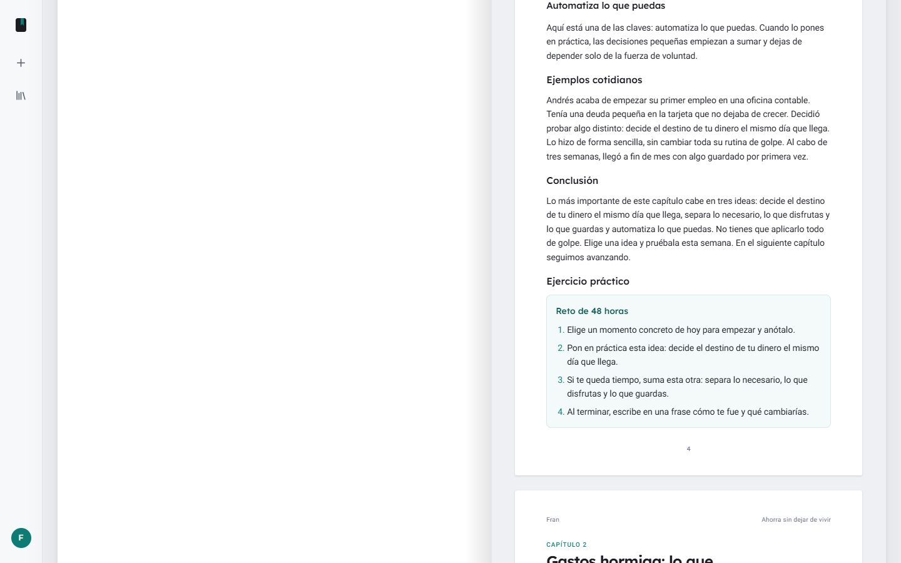

---

### RF-05 · Puntos de validación humana (HITL) — ✅ Cumple

**Qué pide:** el sistema **se detiene** tras proponer el índice y tras escribir el capítulo 1, y espera la aprobación.

**Cómo lo cumple**
- El pipeline termina en el estado `indice_pendiente` y **no sigue** hasta que tocas “Aprobar índice”. Lo mismo con `cap1_pendiente` y “Aprobar y escribir el resto”.
- La pausa se ve con claridad: cae la cinta, la fase se llama “Revisión del índice · Tú” y el libro aparece como “Tu turno” en la biblioteca.
- **La pausa sobrevive a cerrar el navegador:** al volver, el libro sigue en el mismo punto.

**Dónde está**
- Pausas: `frontend/src/lib/api/mock/simulator.ts:124` (índice) y `:199` (capítulo 1)
- Solo continúa al aprobar: `simulator.ts:252` (`approveOutline`) y `:295` (`approveChapterOne`)
- Reanudación tras recargar: `simulator.ts:326` (`resume`)
- Fases con “Tú”: `frontend/src/lib/phases.ts:33`

**Cómo verlo**
1. Crea un ebook y espera a “Tu turno: revisa el índice”. Espera todo lo que quieras: no avanza.
2. Cierra el navegador y vuelve a abrirlo: sigue esperando.
3. Aprueba y verás la segunda pausa en el capítulo 1.

**Prueba:** `RF-05` (dos pruebas) comprueba que, tras esperar, no se escribió ningún capítulo, que la pausa sigue después de recargar y que los capítulos 2 a N esperan la segunda aprobación.

| Pausa 1: índice | Pausa 2: capítulo 1 |
|---|---|
| 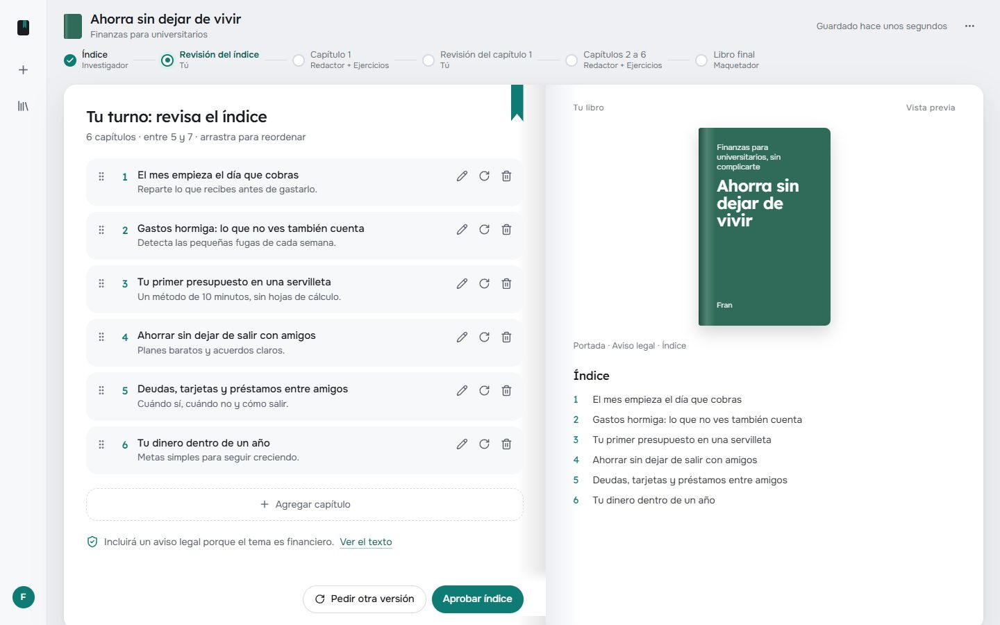 | 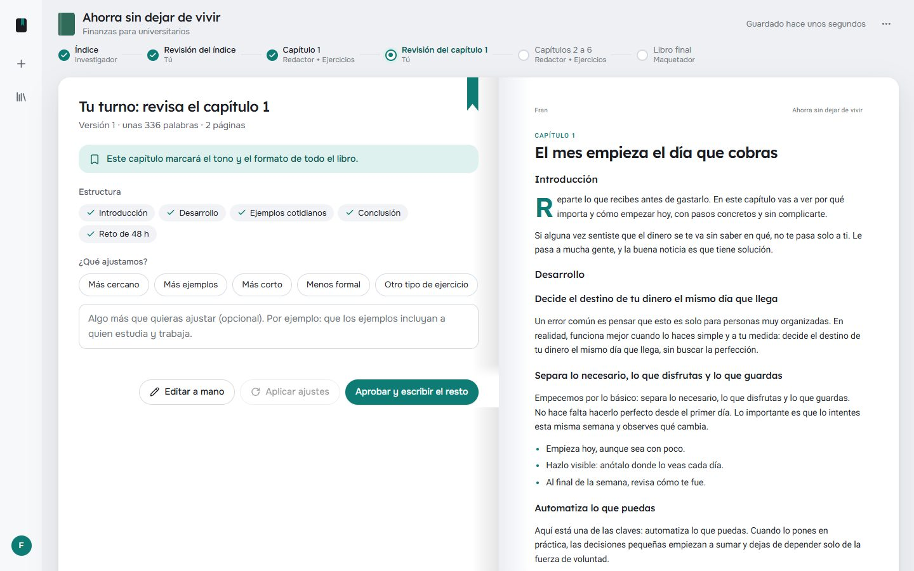 |

---

### RF-06 · Exportación a .md y PDF — ✅ Cumple

**Qué pide:** entregar Markdown con sintaxis limpia (encabezados, listas, citas) y compilar a PDF estructurado.

**Cómo lo cumple**
- **Markdown:** se descarga con portada, aviso legal (como cita `>`), índice numerado, capítulos con encabezados, listas y checklists `- [ ]`. Hay un ejemplo real en [`verificacion/ebook-ejemplo.md`](verificacion/ebook-ejemplo.md).
- **PDF:** se abre una vista de impresión con el tamaño de página elegido (`@page`) y se guarda como PDF desde el navegador. Sale etiquetado y con marcadores. Ejemplo: [`verificacion/ebook-ejemplo.pdf`](verificacion/ebook-ejemplo.pdf).
- *Nota:* en la fase 4, el PDF lo generará el Agente Maquetador en el servidor.

**Dónde está**
- Ensamblado del Markdown: `frontend/src/lib/markdown.ts:15` (`buildMarkdown`)
- Diálogo de exportación: `frontend/src/components/workspace/ExportDialog.tsx:30`
- Vista de impresión: `frontend/src/app/imprimir/page.tsx:64`

**Cómo verlo:** abre “Ahorra sin dejar de vivir” (listo) y toca **Exportar**. Elige **Markdown → Descargar**, o **PDF → Descargar**; en ese caso usa “Imprimir → Guardar como PDF” del navegador.

**Prueba:** `RF-06` descarga el Markdown (con encabezados, listas y citas) y genera el PDF desde la vista de impresión.

| Diálogo | Vista de impresión |
|---|---|
| 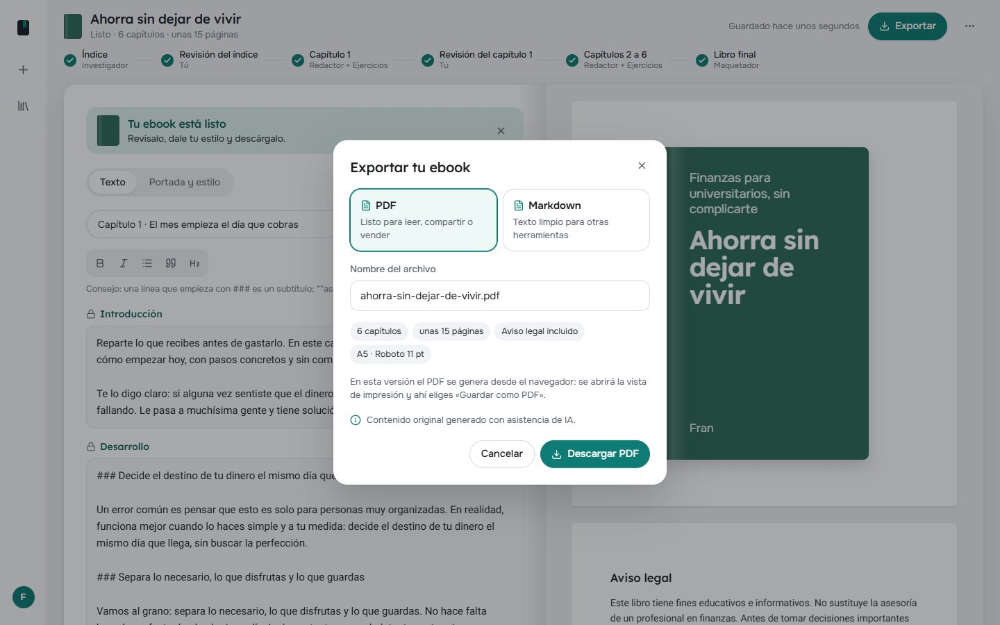 | 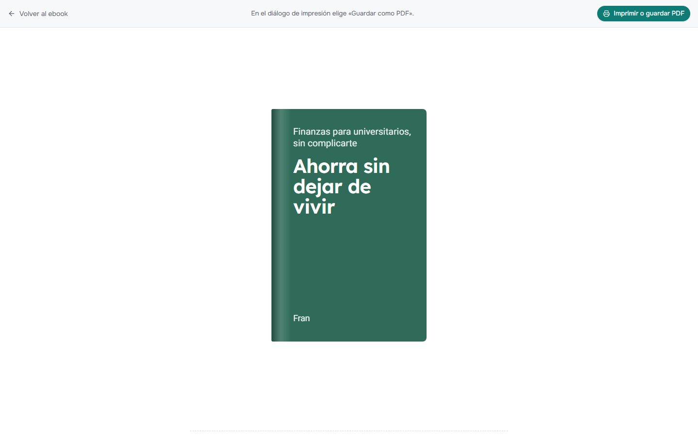 |

---

## Requerimientos no funcionales

### RNF-01 · Tono y estilo de redacción — 🟡 Cumple en la interfaz

**Qué pide:** tono conversacional, empático y directo, con profundidad intermedia (configuración de temperatura del modelo).

**Cómo lo cumple hoy**
- El contenido simulado está escrito de tú a tú (“vas a ver”, “elige una idea”).
- En la revisión del capítulo 1 hay ajustes de tono de un toque: Más cercano, Más ejemplos, Más corto, Menos formal y Otro tipo de ejercicio. Cada ajuste genera una versión nueva.

**Qué falta (fase 4):** la temperatura y el prompt de estilo del Redactor real, con una rúbrica de tono (docs/02 §2).

**Dónde está:** chips `frontend/src/lib/types.ts:138`; efecto en el texto `frontend/src/lib/api/mock/content.ts:378`; nueva versión `frontend/src/lib/api/mock/simulator.ts:300`

**Cómo verlo:** en “Hablar claro sin pelear”, toca **Más cercano → Aplicar ajustes**. Aparece la versión 2 y el texto empieza con “Te lo digo claro”.

**Prueba:** `RNF-01` comprueba el tuteo, los cinco chips y que la versión 2 aplica el ajuste.

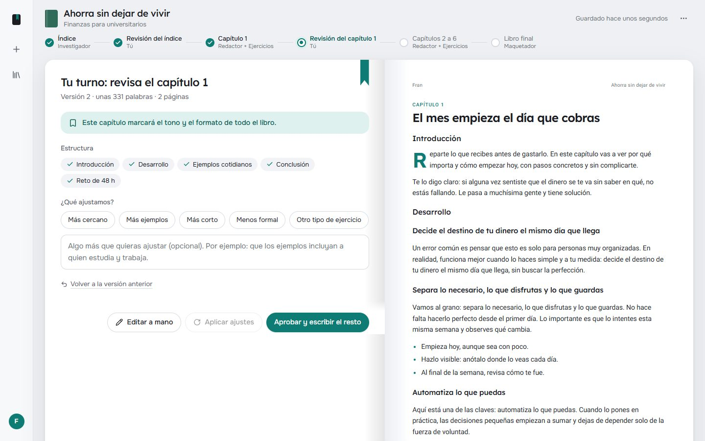

---

### RNF-02 · Menos de 60 segundos por capítulo — 🟡 Cumple en la interfaz

**Qué pide:** que cada capítulo tarde menos de 60 segundos, para mantener un flujo fluido.

**Cómo lo cumple hoy**
- El texto aparece **en vivo** (streaming) con un cursor, además de avance por secciones, tiempo estimado y la posibilidad de leer los capítulos terminados mientras se escriben los demás.
- Con la velocidad normal de la simulación, **el capítulo 1 tardó 7 segundos**.

**Qué falta (fase 4):** medir el tiempo real con el proveedor de IA elegido (docs/02 §2: percentil 95 menor de 60 s).

**Dónde está:** streaming `frontend/src/lib/api/mock/simulator.ts:168`; tiempo estimado `frontend/src/components/workspace/stages/Writing.tsx:30`; lectura en vivo `frontend/src/components/workspace/previews/ChapterScroller.tsx:8`

**Cómo verlo:** aprueba un índice con la velocidad **Normal** y mira “Tu libro” mientras se escribe.

**Prueba:** `RNF-02` comprueba que el texto crece mientras se escribe y que el capítulo termina en menos de 60 s (resultado: 7 s).

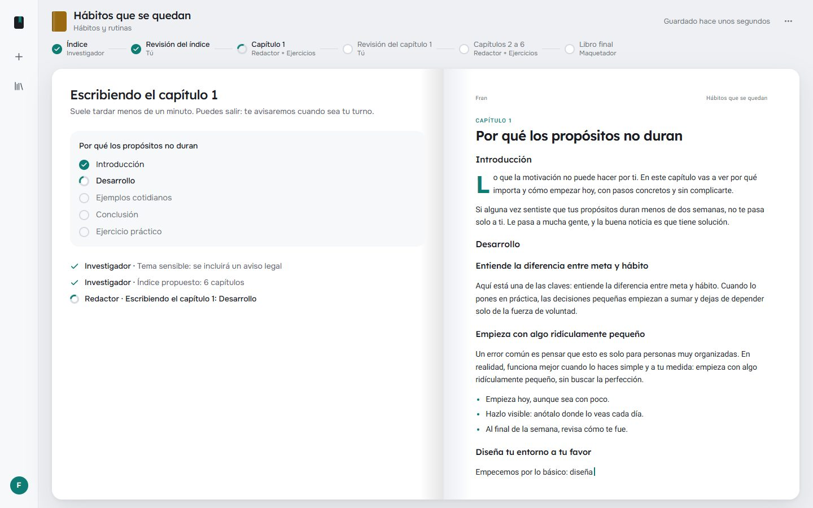

---

### RNF-03 · Consistencia y cohesión textual — 🟡 Cumple en la interfaz

**Qué pide:** coherencia de términos y estilo en todos los capítulos, sin repeticiones ni contradicciones.

**Cómo lo cumple hoy**
- El capítulo 1 aprobado es el **ancla de tono**, y la interfaz lo dice en dos momentos: en la pausa (“Este capítulo marcará el tono y el formato de todo el libro”) y durante la redacción (“Cada capítulo sigue el tono y el formato del capítulo 1 que aprobaste”).
- Los capítulos se escriben **uno detrás de otro**, nunca en paralelo, para que cada uno conozca los anteriores.

**Qué falta (fase 4):** la guía de estilo extraída del capítulo 1 y los resúmenes de capítulos anteriores que recibirá el Redactor (docs/03 §8).

**Dónde está:** escritura secuencial `frontend/src/lib/api/mock/simulator.ts:203` (`writeRest`); mensajes `ChapterOneReview.tsx:101` y `Writing.tsx:127`

**Prueba:** `RNF-03` muestrea el estado durante la redacción y comprueba que **nunca** hay dos capítulos escribiéndose a la vez.

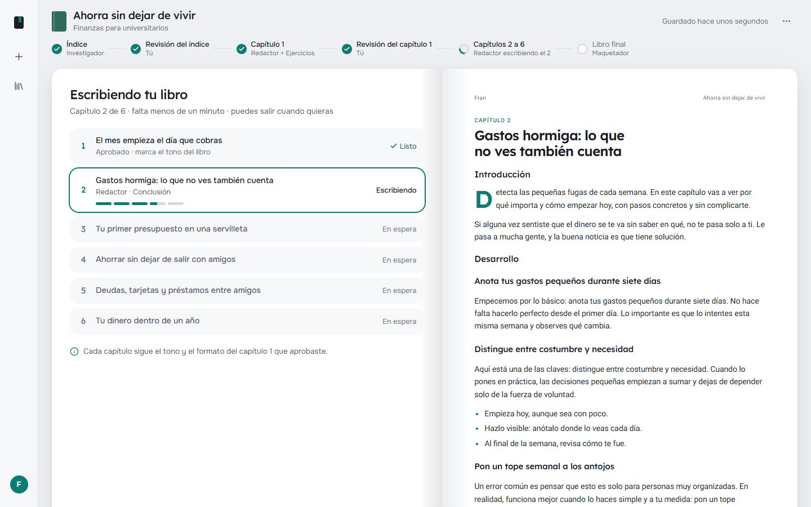

---

### RNF-04 · Arquitectura modular de cuatro agentes — ⏳ Pendiente (fase 4)

**Qué pide:** un backend modular con Agente Investigador, Redactor, de Ejercicios y Maquetador/Exportador, con prompts intercambiables.

**Qué hay hoy**
- La arquitectura está diseñada en [03-arquitectura](./03-arquitectura.md) §2 y §9: un módulo por agente (`backend/app/agents/…`) y los prompts en archivos (`backend/app/prompts/…`).
- La simulación ya separa las responsabilidades por agente, y la interfaz muestra a los cuatro en las fases y en la bitácora.

**Dónde está:** Investigador `frontend/src/lib/api/mock/simulator.ts:95`; Redactor `:136`; Ejercicios `frontend/src/lib/api/mock/content.ts:446`; Maquetador `simulator.ts:236`; fachada para conectar el backend `frontend/src/lib/api/index.ts:26`

**Prueba:** `RNF-04` comprueba que las fases muestran Investigador, Redactor + Ejercicios y Maquetador, y que en la bitácora participan exactamente los cuatro agentes.

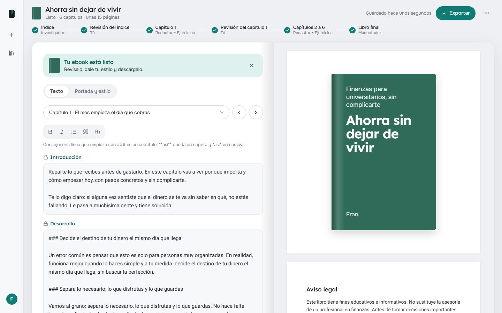

---

## Requerimientos de accesibilidad

### RA-01 · Jerarquía H1/H2/H3 en Markdown y PDF — ✅ Cumple

**Qué pide:** jerarquía clara de encabezados para lectores de pantalla.

**Cómo lo cumple**
- **Markdown:** `#` para el título y cada capítulo, `##` para las secciones y `###` para los subtemas, sin saltar niveles.
- **PDF:** etiquetado (`StructTreeRoot`), con marcadores, idioma `es` y **exactamente H1, H2 y H3**.
- **Editor:** si alguien escribe un `#` o `##` a mano, se convierte en subtítulo `###` para no romper la estructura.

**Dónde está:** capítulos en el Markdown `frontend/src/lib/markdown.ts:29`; conversión en el editor `frontend/src/components/workspace/stages/TextEditor.tsx:13`; portadilla y niveles del PDF `frontend/src/app/imprimir/page.tsx:93`; niveles en la vista previa `frontend/src/components/book/ChapterPage.tsx:63`

**Cómo verlo:** descarga el Markdown y revisa los `#`, o abre el PDF con un lector de pantalla (NVDA, VoiceOver o TalkBack) y navega por encabezados.

**Prueba:** `RA-01` recorre todos los encabezados del Markdown (sin saltos, máximo nivel 3, un H1 por capítulo), lee las etiquetas del PDF (H1, H2, H3) y comprueba que un `#` escrito a mano queda como `###`.

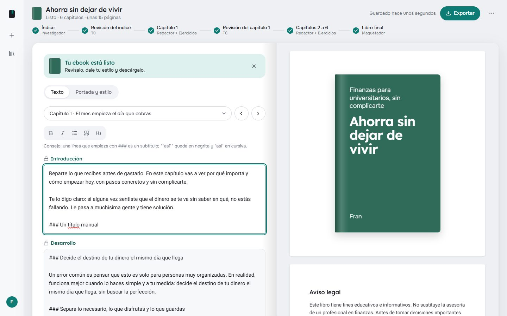

---

### RA-02 · Lenguaje claro y comprensible — 🟡 Cumple en la interfaz

**Qué pide:** sintaxis directa y explicaciones simples, legibles para público joven o sin formación técnica.

**Cómo lo cumple hoy:** el libro de prueba obtiene **INFLESZ 78,9, “bastante fácil”**, con 9,4 palabras por frase y 1,9 sílabas por palabra (2.173 palabras analizadas). La escala INFLESZ considera 55-65 “normal” y 65-80 “bastante fácil”.

**Qué falta (fase 4):** las reglas de claridad en el prompt del Redactor, y medir el mismo índice sobre textos reales de la IA.

**Dónde está:** cálculo del índice `frontend/e2e/legibilidad.ts:29`; resultado en [`verificacion/RA-02-legibilidad.json`](verificacion/RA-02-legibilidad.json)

**Prueba:** `RA-02` calcula el índice sobre el libro exportado y exige 55 o más.

---

### RA-03 · Contraste y tipografía limpia en el PDF — ✅ Cumple

**Qué pide:** fondo blanco, texto negro o gris oscuro, Arial, Helvetica o Roboto, y **11 pt como mínimo**.

**Cómo lo cumple**
- “Portada y estilo” **solo ofrece** Roboto, Arial y Helvetica, y tamaños de 11, 12 y 13 pt. No hay forma de elegir menos de 11.
- La hoja del libro es **siempre blanca**, también con el tema oscuro.
- Si eliges un color de portada con poco contraste, avisa y ofrece “Usar el tono accesible”, que garantiza al menos 4,5:1.
- Medido en el PDF: cuerpo a **14,67 px (= 11 pt)** en Roboto, texto `rgb(27,29,35)` sobre `rgb(255,255,255)`, con un **contraste de 16,9:1**.

**Dónde está:** opciones `frontend/src/lib/design.ts:17-18`; tono accesible `design.ts:66`; validación en vivo `frontend/src/components/workspace/stages/DesignPanel.tsx:25`; hoja siempre blanca `frontend/src/app/globals.css:168`

**Cómo verlo:** en un libro listo, abre **Portada y estilo → Color de tela → color personalizado** y elige un amarillo claro. Verás el aviso y el botón para corregirlo.

**Prueba:** `RA-03` comprueba las opciones permitidas, el aviso y la corrección del contraste, y mide tamaño, fuente, fondo y contraste reales en la vista de impresión.

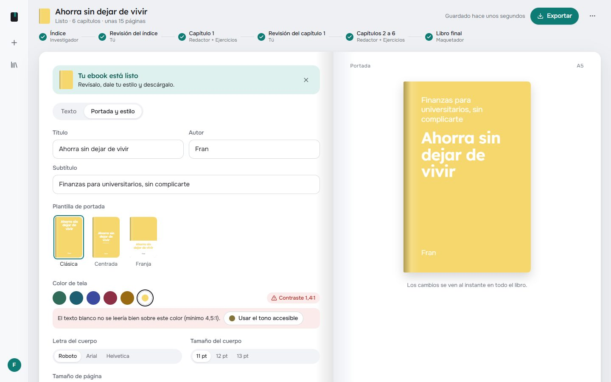

---

## Requerimientos éticos y de responsabilidad

### RÉR-01 · Originalidad y prevención de plagio — 🟡 Cumple en la interfaz

**Qué pide:** generar contenido original, sin copiar fuentes protegidas.

**Cómo lo cumple hoy**
- Todo el contenido sale de plantillas propias del proyecto; no se copia texto de ninguna fuente externa.
- **Transparencia:** el diálogo de exportación, el Markdown y el PDF indican “Contenido original generado con asistencia de IA”.

**Qué falta (fase 4):** instrucciones antiplagio en los prompts del Investigador y del Redactor y, opcionalmente, una verificación de similitud antes de exportar (docs/02 §4).

**Dónde está:** `frontend/src/components/workspace/ExportDialog.tsx:109` y `frontend/src/lib/markdown.ts:37`

**Prueba:** `RÉR-01` comprueba la nota en el diálogo y al final del Markdown.

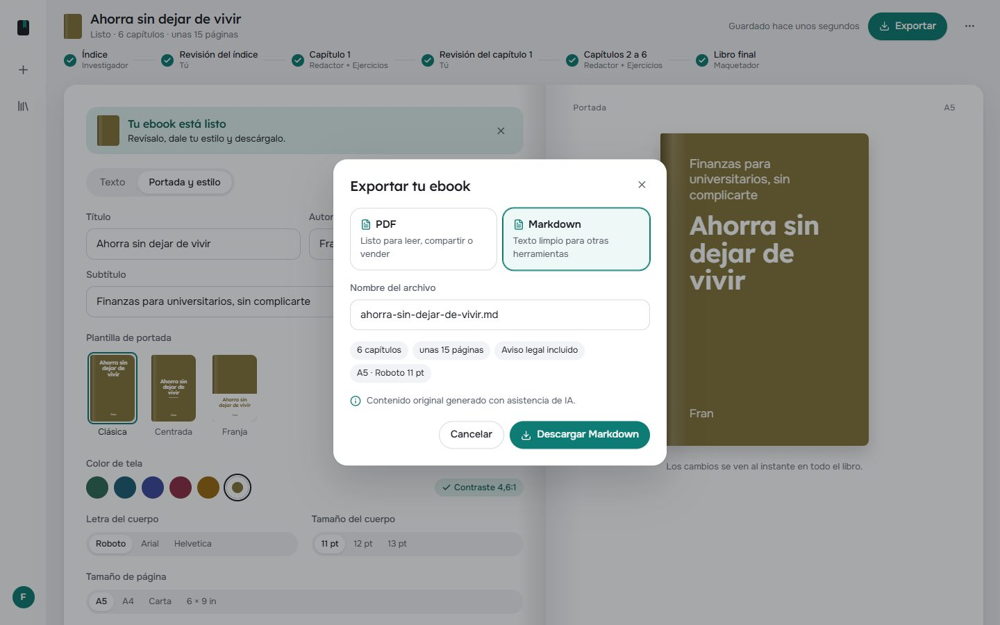

---

### RÉR-02 · Aviso legal en temas sensibles — ✅ Cumple

**Qué pide:** todo ebook de finanzas, emociones o autoayuda incluye **automáticamente** un aviso legal visible.

**Cómo lo cumple**
- Cada tema se clasifica (financiero, salud emocional, salud física, autoayuda) y recibe su texto de aviso.
- Se anuncia **desde el índice** (“Incluirá un aviso legal porque el tema es financiero”, con “Ver el texto”).
- En el libro va **después de la portada y antes del índice**. En el editor aparece bloqueado (“no se puede quitar”) y no hay forma de borrarlo.

**Dónde está:** textos `frontend/src/lib/guardrails.ts:34`; clasificación `frontend/src/lib/niches.ts:22`; aviso en el índice `OutlineReview.tsx:287`; bloque bloqueado `TextEditor.tsx:151`; posición en el libro `frontend/src/lib/markdown.ts:22`

**Cómo verlo**
1. “Ahorra sin dejar de vivir” → Texto → en el selector elige **Aviso legal**: está bloqueado.
2. Crea un ebook sobre “ansiedad antes de un examen”: el aviso es de salud emocional.
3. Crea uno de “Gestión del tiempo”: no lleva aviso.

**Prueba:** `RÉR-02` (dos pruebas) comprueba el aviso en el índice, su posición en el Markdown, el bloqueo en el editor, el caso emocional y la ausencia de aviso en un tema no sensible.

> **Decisión a confirmar:** hoy, Gestión del tiempo, Organización del estudio y Primer empleo **no** llevan aviso, por tratarse de habilidades prácticas. Si prefieres que *todo* ebook de crecimiento personal lo lleve, es un cambio de una línea en `niches.ts`.

| Índice | Editor | Tema emocional |
|---|---|---|
| 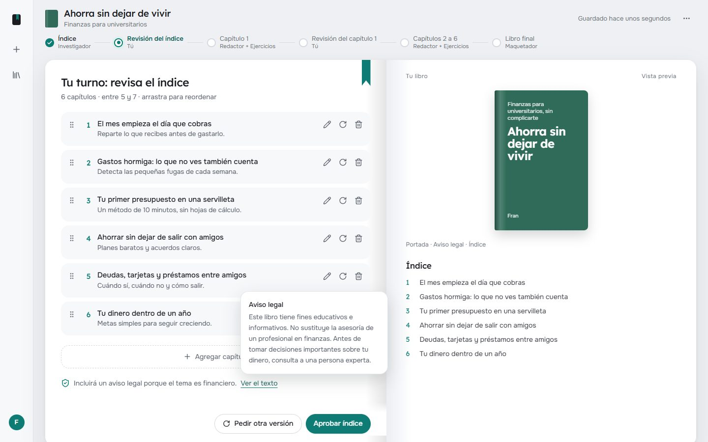 | 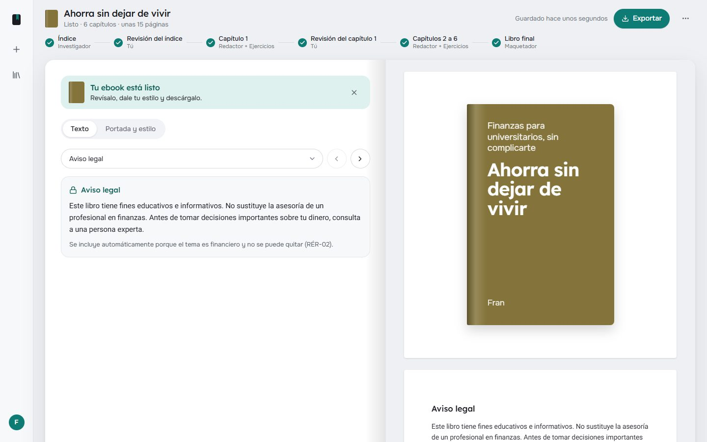 | 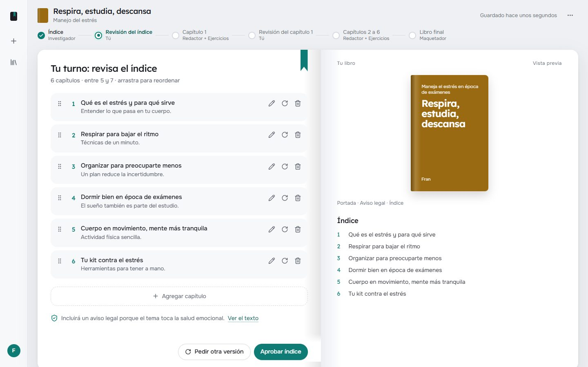 |

---

### RÉR-03 · Mitigación de sesgos y estereotipos — 🟡 Cumple en la interfaz

**Qué pide:** ejemplos cotidianos sin estereotipos de género ni discriminación, y sin soluciones poco éticas.

**Cómo lo cumple hoy**
- Los ejemplos usan 12 personas (6 mujeres y 6 hombres) con contextos que no siguen estereotipos: Valentina estudia Ingeniería Mecánica, José estudia Enfermería, Diego cuida a su hermano menor, Sofía repara celulares…
- Las personas **rotan a lo largo del libro** y dos capítulos seguidos nunca repiten género. En el libro de prueba salieron Diego, Camila, Tomás, Valentina, Samuel y Daniela: 3 mujeres y 3 hombres.
- Las soluciones propuestas son hábitos y acciones responsables (planificar, ahorrar, conversar).

**Qué falta (fase 4):** reglas de diversidad en los prompts del Redactor y del Agente de Ejercicios, y una revisión automática de sesgos antes de mostrar cada capítulo.

**Dónde está:** personas `frontend/src/lib/api/mock/content.ts:246`; rotación `content.ts:415`; resultado en [`verificacion/RER-03-personas.json`](verificacion/RER-03-personas.json)

**Prueba:** `RÉR-03` extrae las personas de todos los ejemplos del libro y comprueba que aparecen mujeres y hombres.

---

## Defectos encontrados y corregidos durante esta verificación

La verificación no se limitó a confirmar: encontró cuatro problemas reales, que ya están corregidos.

| Requerimiento | Problema | Corrección |
|---|---|---|
| RÉR-03 | Algunos contextos repetían estereotipos (mujer enfermera y cuidadora, hombre futbolista). | Se reescribieron los perfiles con roles no estereotipados. |
| RÉR-03 | Las personas se elegían al azar por capítulo y un libro salió con 6 mujeres y 0 hombres (la prueba falló). | Ahora rotan a lo largo del libro y alternan el género. |
| RA-01 | El PDF no tenía H1: el título estaba oculto y los niveles empezaban en H2. | Portadilla visible con el título en H1; capítulos en H1, secciones en H2 y subtemas en H3. |
| RA-01 | En la vista previa, los subtemas tenían el mismo nivel que las secciones. | Los subtemas bajaron un nivel. |
